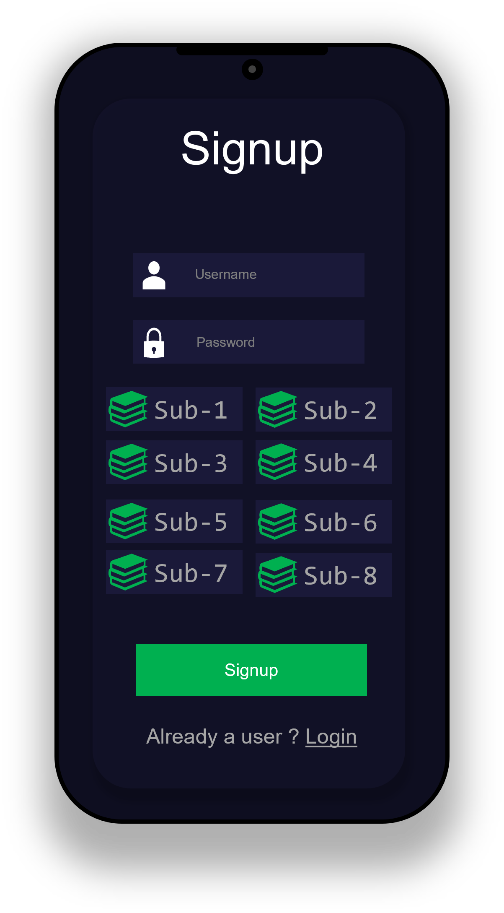
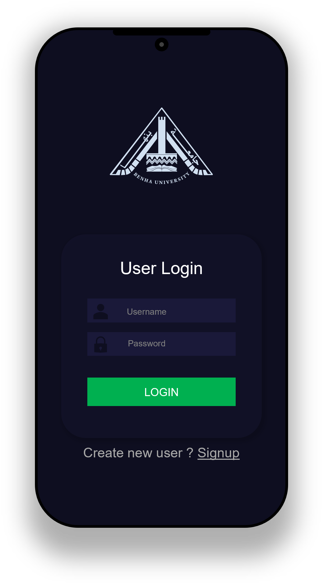
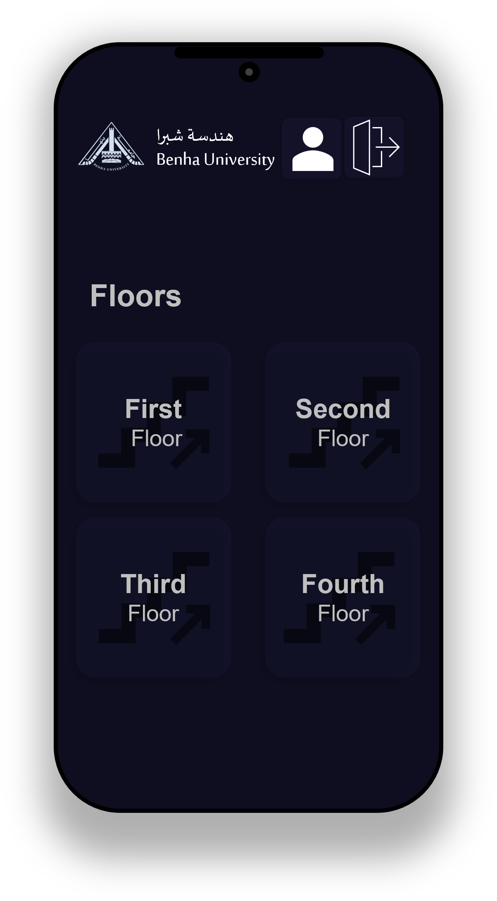
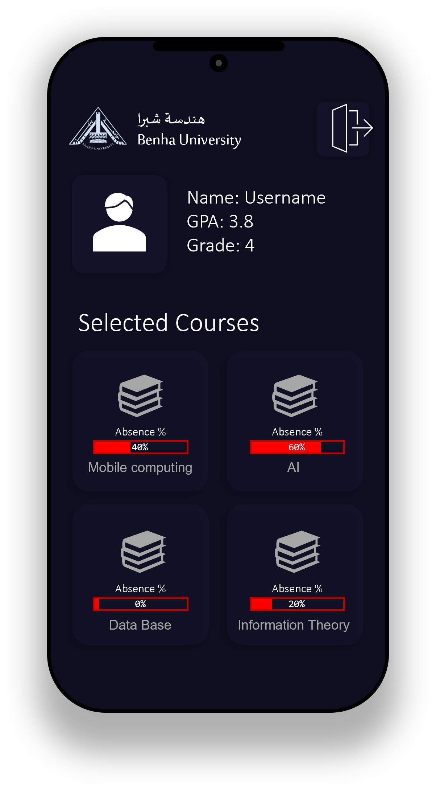
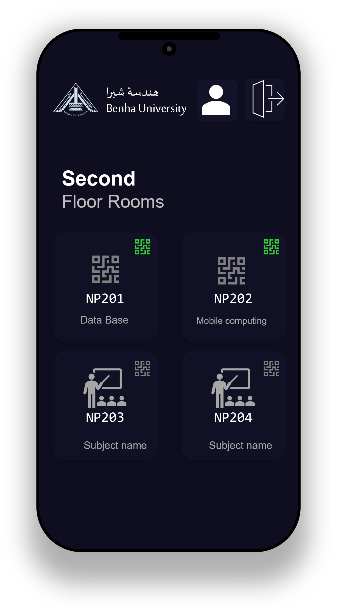
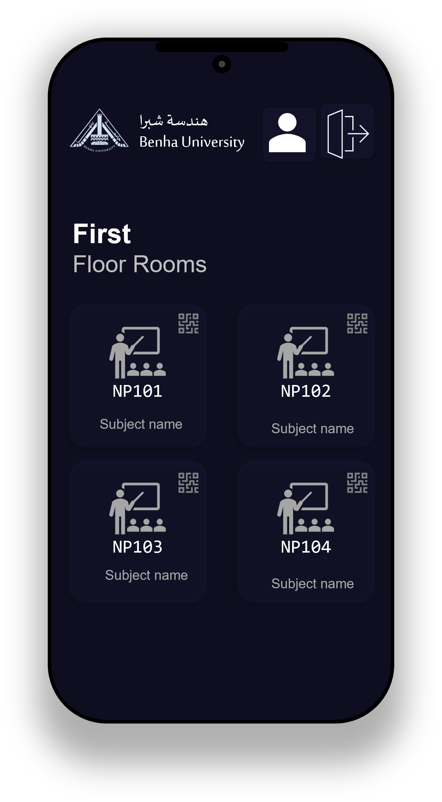

# Lectures Housing - QR Code Attendance System

  

## Overview
The **Lectures Housing** project is designed to provide a convenient and efficient solution for professors at universities to take attendance for students using QR code technology. This system aims to streamline the attendance process, enhance classroom management, and allow professors to focus more on delivering quality education.

## Goal
Our goal is to develop a user-friendly application that enables professors to effortlessly record attendance by scanning QR codes associated with each student. By doing so, we aim to:
- Reduce the time and effort required for attendance management.
- Improve accuracy in attendance tracking.
- Provide valuable data insights to enhance student learning outcomes.
- Enhance the overall educational experience for both professors and students.

## Features
- **User Authentication**:
  - **Signup**: Students can create an account by entering their name as a username and using their ID as a password.
  - **Login**: Existing users can log in to access their profiles and attendance records.

- **Subject Selection**:
  - Students can select their subjects during the signup process.

- **Floor and Room Navigation**:
  - Students can navigate through different floors and rooms to check their class schedules.
  - Professors can update room names and generate QR codes for attendance.

- **Profile Page**:
  - Displays student information, including GPA, grade, and absence percentage for each subject.
  - Future feature: Absence percentage calculation.

## Screenshots
### Login Page and Signup Page

  <table style="border: 0">
    <tr>
      <td align="center">
        
         
        <strong>Login Page</strong>
      </td>
      <td align="center">
        
         
        <strong>Signup Page</strong>
      </td>
    </tr>
  </table>

### Floor Selection and Profile Page

  <table style="border: 0">
    <tr>
      <td align="center">
        
         
        <strong>Floor Selection</strong>
      </td>
      <td align="center">
        
         
        <strong>Profile Page</strong>
      </td>
    </tr>
  </table>

### Room Details

  
   
  <strong>Room Details</strong>

## How It Works
1. **For Students**:
   - Sign up using your name and ID.
   - Select your subjects.
   - Navigate through floors and rooms to find your class schedule.
   - View your profile to check attendance and academic details.

2. **For Professors**:
   - Log in to access the system.
   - Generate QR codes for attendance.
   - Update room names and manage class schedules.

## Future Enhancements
- Implement absence percentage calculation.
- Add more detailed analytics for professors.
- Integrate with university systems for seamless data flow.

## Contributors
- Mazen Khaled Salah (211902089)
- Ahmed Khaled Mahmoud (211902101)
- Mohamed Abd-elazeem Mohamed (211902079)
- Ahmed Elhussien Abdelaliem (211902104)
- Ahmed Mostafa Sayed (211902112)
- Mostafa Ali Abdelsamea (211902097)

---

**Note**: This project is part of the College Lecture Housing initiative at Benha University, aimed at improving classroom management and attendance tracking using modern technology.
